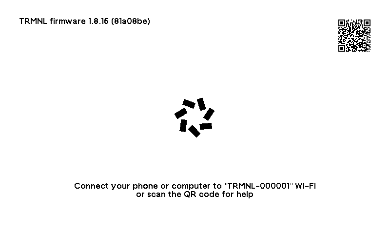

# trmnl-sim

A simulator for TRMNL devices that runs **unmodified compiled firmware**: the
`bootloader.bin`, `partitions.bin` and `firmware.bin` you would flash, plus the build's
`firmware.elf`. It gives you a window with the e-paper display and the device's controls,
and an HTTP control API for automated tests
([trmnl-spec](https://github.com/usetrmnl/trmnl-spec)), locally or in GitHub Actions.

The device is picked from the build directory's name (the PlatformIO env) or `--board`:

| PlatformIO env | Device | Chip | Display | Controls |
|---|---|---|---|---|
| `trmnl` | TRMNL OG | ESP32-C3 (RISC-V) | 7.5" 800×480, UC8179 over SPI | button |
| `trmnl_4clr` | TRMNL BWRY | ESP32-C3 (RISC-V) | 7.5" 800×480 black/white/yellow/red (GDEM075F52) | button |
| `TRMNL_X` | TRMNL X | ESP32-S3 (dual-core Xtensa LX7) + ESP32-C5 modem | 10.3" 1872×1404 parallel panel, 16 grays | touch bar (left/center/right), magnetic dock |
| `trmnl_gen2` | TRMNL OG gen 2 | ESP32-C5 (RISC-V, 2.4 + 5 GHz WiFi) | 7.5" 800×480, UC8179 over SPI | button, USB power (dock switch) |
| `trmnl_gen2_4clr` | TRMNL BWRY gen 2 | ESP32-C5 | 7.5" 800×480 black/white/yellow/red | button, USB power (dock switch) |

BYOD boards (the firmware's other `device_list[]` rows; `--board` takes the `DEVICE_MODEL`):

| PlatformIO env | `--board` | Device | Chip | Display | Battery |
|---|---|---|---|---|---|
| `seeed_xiao_esp32c3` | `seeed_esp32c3` | XIAO ESP32-C3 + 7.5" panel | ESP32-C3 | 7.5" 800×480 UC8179 | none wired |
| `TRMNL_7inch5_OG_DIY_Kit` | `xiao_epaper_display` | TRMNL 7.5" DIY Kit | ESP32-S3 | 7.5" 800×480 UC8179 | ADC, switched divider |
| `TRMNL_7inch5_OG_DIY_Kit_3CLR` | `xiao_epaper_3clr` | TRMNL 7.5" BWR DIY Kit | ESP32-S3 | 7.5" 800×480 black/white/red UC8179 (two planes) | ADC, switched divider |
| `TRMNL_7inch5_OG_DIY_Kit_6CLR` | `xiao_epaper_6clr` | TRMNL 7.3" Spectra 6 DIY Kit | ESP32-S3 | 7.3" 800×480 Spectra 6 | ADC, switched divider |
| `TRMNL_4inch26_DIY_Kit` | `xiao_epaper_mini` | TRMNL 4.26" DIY Kit | ESP32-S3 | 4.26" 800×480 SSD1677 | ADC, switched divider |
| `seeed_reTerminal_E1001` | `reterminal_e1001` | Seeed reTerminal E1001 | ESP32-S3 | 7.5" 800×480 UC8179 | ADC, switched divider |
| `seeed_reTerminal_E1002` | `reterminal_e1002` | Seeed reTerminal E1002 | ESP32-S3 (8 MB octal PSRAM) | 7.3" 800×480 Spectra 6 (GDEP073E01) | ADC, switched divider |
| `seeed_reTerminal_E1004` | `reterminal_e1004` | Seeed reTerminal E1004 | ESP32-S3 | 13.3" 1200×1600 Spectra 6, two controllers (CS/CS2) | ADC, switched divider |
| `seeed_sticky` | `seeed_sticky` | Seeed Sticky | ESP32-S3 | 3.97" 800×480 SSD1677, switched supply | BQ27220 |
| `xteink_x4` | `xteink_x4` | Xteink X4 | ESP32-C3 | 4.26" 800×480 SSD1677 | (not read) |
| `xteink_x3` | `xteink_x3` | Xteink X3 | ESP32-C3 | 3.68" 792×528 UC81xx | BQ27220 |
| `WAVESHARE_397` | `waveshare_397` | Waveshare ESP32-S3 3.97" | ESP32-S3 | 3.97" 800×480 SSD1677 | AXP2101 |
| `m5_paper_mono` | `m5_paper_mono` | M5Paper Mono | ESP32-S3 | 800×480 SSD1677; supply and RST on an M5IOE1 expander | none (4.2 V) |
| `m5_paper_color` | `m5_paper_color` | M5Paper Color | ESP32-S3 | 4" 400×600 Spectra 6; supply from the PY32 PMIC | none (4.2 V) |
| `TRMNL_X_PAPERS3` | `m5_papers3` | M5Stack PaperS3 | ESP32-S3 | 4.7" 960×540 parallel (ED047TC1), 16 grays | ADC |
| `TRMNL_X_LILYGO_T5PRO` | `lilygo_t5pro` | LilyGo T5 4.7" S3 Pro | ESP32-S3 | 4.7" 960×540 parallel, EPDiy V7 (TCA9535 + TPS65185) | BQ27220 |
| `trmnl_steam` | `trmnl_steam` | TRMNL Steam | ESP32-C3 | 5.83" 648×480 UC81xx | ADC |
| `TRMNL_X_SENSORIAC5` | `sensoria_c5` | Sensoria C5 | ESP32-C5 (8 MB quad PSRAM) | 1280×720 parallel over PARLIO, 16 grays (PCA9535 + TPS65185) | (not read) |



## What is simulated

Common to all devices:

| Part | How |
|---|---|
| Boot | The real mask ROM (from Espressif's ROM ELFs) and your 2nd-stage bootloader: partition table, OTA slot selection, SHA-256 check, flash MMU, deep-sleep wake stubs |
| WiFi | A high-level model replaces the binary driver (scans, joins, soft-AP); lwIP, DHCP, DNS, TLS, AsyncTCP and the captive portal are the firmware's own |
| Network | A user-mode router/NAT (`vnet`) to the internet, or `--offline`. The host is `10.0.2.2`; an NTP server at `10.0.2.123` gives the host's clock (offline, NTP names resolve to it) |
| Sleep | Deep sleep (timer and GPIO wake, RTC memory, correct wake cause) and light sleep |
| Persistence | Flash is a file, so credentials, API key and SPIFFS/LittleFS survive restarts; `--erase` gives a factory-fresh device |

**TRMNL OG** (`trmnl`) and **TRMNL BWRY** (`trmnl_4clr`, the same board with a 4-color
panel, detected from the firmware):

| Part | How |
|---|---|
| CPU | RV32IMC(A) interpreter, 160 MHz, cycle-counted virtual time |
| Peripherals | UART0, GPIO/IO_MUX, interrupt matrix, SYSTIMER, TIMG, RTC_CNTL, eFuse, SPI flash + 4 MB NOR, GPSPI2, I2C, SAR ADC, cache/MMU, RNG, SHA, AES + GDMA, RSA |
| Display | UC8179 over SPI, refreshed from the LUT waveforms: full, fast, partial and 4-gray refreshes and BUSY timing behave like the panel. The `REV` read returns `--panel-rev` |
| 4-color panel (BWRY) | One 2 bit/pixel image (`DTM1`) and the built-in ~16 s refresh: 9 s of black/white flashing, then exact black/white/yellow/red. **Refresh flashing** in the window turns the flashes off |
| Button | GPIO2 with pull-up: presses, holds, double-clicks, deep-sleep wake |
| Battery | ADC on GPIO3 behind a ½ divider; settable voltage |

**TRMNL OG gen 2** (`trmnl_gen2`) and **TRMNL BWRY gen 2** (`trmnl_gen2_4clr`): the OG's
panels on an ESP32-C5 board (SCK 6, MOSI 1, CS 4, RST 2, DC 5, BUSY 0, button GPIO 3).

| Part | How |
|---|---|
| CPU | RV32IMAC with the C5's CLIC (vectored, levelled, nested interrupts) at 240 MHz |
| Boot | The production-silicon (v1.x) ROM, `esp32c5_rev100_rom.elf`; bootloader at 0x2000 |
| Peripherals | 384 KB HP + 16 KB LP SRAM, 8/16 MB flash and 8 MB quad PSRAM behind the cache MMU, PARLIO TX, CLIC, PCR, the LP domain (wake and reset causes, LP_TIMER), SYSTIMER, TIMG, GPIO, UART0 and the USB serial/JTAG console, I2C, GPSPI2, eFuse, RNG |
| Crypto | SHA, AES/AES-GCM, RSA, ECC and ECDSA verification accelerators, so TLS runs on them as on the chip |
| WiFi | Dual band: also **TRMNL-Sim-5G** (channel 36, any password), joined on the C5's own radio (`WiFi-Band: 5`) |
| Battery | BQ27427 fuel gauge on I2C (SDA 23 / SCL 10; BWRY: 11 / 12) |
| USB power | BQ25616 PG (GPIO 25) and STAT (GPIO 24) follow the dock switch; reported as `USB-Connected` / `Battery-Charging` |
| Firmware | IDF 5.5 built from source with Arduino 3.3, `DEV_FIRMWARE` logging |

**Seeed reTerminal E1002** (`seeed_reTerminal_E1002`, a BYOD board): the ESP32-S3 below with
an SPI panel driven through bb_epaper (SCK 7, MOSI 9, CS 10, RST 12, DC 11, BUSY 13).

| Part | How |
|---|---|
| Display | One 4 bit/pixel image (`DTM1`) and a ~19 s refresh: 12 s of flashing through the six colors, then exact black/white/yellow/red/blue/green |
| Button | GPIO3 with pull-up |
| Battery | ADC on GPIO1 behind a ½ divider, connected while GPIO21 is high |
| Firmware | Arduino 2.0.17 on IDF 4.4 libraries: PSRAM, zero-copy WiFi transmit and the portal work |

**BYOD boards.** SPI-panel boards are one data-driven board (`board/spi_epd.rs`) with a row
per `device_list[]` entry: pins, battery (ADC divider, BQ27220, AXP2101 or none), panel
supply switching (an unpowered panel ignores its inputs and loses its RAM) and the panel:

| Controller | How |
|---|---|
| UC81xx | The UC8179 model at any size, with per-panel 4-gray response fitted to bb_epaper; black/white/red panels keep two 1-bit planes and a ~16 s refresh |
| SSD16xx (SSD1677, SSD1683) | RAM windows and counters, data entry modes, new/old image planes, the built-in and custom (`0x32`) waveforms, differential partial refreshes, deep sleep |
| Two controllers (E1004) | Each half gets the commands sent while its chip select is low; BUSY while either is busy |
| Parallel (PaperS3, T5 Pro, Sensoria C5) | The X's panel model at 960×540 over LCD_CAM (power from GPIOs, or a TCA9535 + TPS65185); the Sensoria C5's 1280×720 panel over PARLIO with a PCA9535 |

Firmware bugs these boards show (trmnl-spec's tests fail on each):
- `trmnl_steam` reboots forever: its `device_list[]` row is behind `#ifdef CMD_CS1_CS2`, so
  `pDevice` stays NULL.
- Flipping an uncompressed BMP overruns the download buffer on panels that aren't 800×480
  (the X3 and E1004 crash; the M5Paper Color shows garbage).
- `dpList[]` holds bb_epaper product ids where `setPanelType()` expects panel types: 1-bit
  images never show on the M5Paper Mono.
- SSD16xx boards: BMP/Group5 images update only the new-image RAM, so the old picture stays up.
- The Waveshare 3.97" picture is one row too high; the Sticky's 4-gray LUT is overwritten, so
  it shows black and white only.
- The BWR DIY kit sends 2-bit color PNGs through the 4-gray planes: wrong inks.
- The Xteink X4 reports 0 V (`batt_pin` 0xff although `PIN_BATTERY` is 0).
- The gen-2 BWRY lacks `BOARD_TRMNL_4CLR`: images go out as two 1-bit planes, so only the top
  half changes, in the wrong inks.
- On 960 px parallel panels the setup screen's instructions overflow the width.
- The Sensoria C5 reboots instead of sleeping: FastEPD deletes its PARLIO TX unit without
  disabling it, and IDF 5.5's `ESP_ERROR_CHECK` aborts.

**TRMNL X** (`TRMNL_X`):

| Part | How |
|---|---|
| CPU | Two Xtensa LX7 cores (windowed ABI, FPU, MAC16, loops, atomics) at the firmware's clock; idle cores sleep |
| Peripherals | 16 MB flash and 8 MB octal PSRAM behind the cache MMU, interrupt matrix, SYSTIMER, GPIO, UART0 with flow control, USB serial/JTAG, I2C, GPSPI2, LCD_CAM + GDMA, SHA/AES/RSA, eFuse, RTC |
| Display | 1872×1404 EPDiy-style panel fed over LCD_CAM with a TPS65185 PMIC; the per-frame drive is applied to each pixel, so 1-bit and 16-gray images come out as drawn |
| Touch bar | IQS323 on I2C: left/center/right taps and holds (several at once); RDY wakes from deep sleep |
| Dock | Powers USB and the charger (TCA9535 inputs, the gauge's charging flag, the request headers); docking wakes shipment mode |
| Battery | BQ27427 fuel gauge |
| 5 GHz modem | ESP32-C5 running ESP-AT over UART at 5 Mbit/s: factory flashing through its ROM loader, then WiFi, SNTP and HTTP, made from the host so they reach the same mock servers |

## Requirements

- Rust (stable, 1.85+).
- A PlatformIO build of the firmware in `../trmnl-firmware` (`pio run -e trmnl`, `-e TRMNL_X`,
  ... or a BYOD board's env). The X build also needs its `littlefs.bin`, which its post-build
  script downloads.
- The chips' mask ROM ELFs: the C3 and S3 ones come with PlatformIO's `tool-esp-rom-elfs`;
  the C5's production-silicon ROM (`esp32c5_rev100_rom.elf`) comes from Espressif's
  [esp-rom-elfs](https://github.com/espressif/esp-rom-elfs/releases), which
  `scripts/fetch-rom-elfs.sh` (run by `bin/setup`) puts in `rom/`. `--rom` or `TRMNL_SIM_ROM`
  overrides the search.
- PlatformIO needs Python; the integration tests
  ([trmnl-spec](https://github.com/usetrmnl/trmnl-spec)) need Ruby 3.2+ with Bundler.

## Quick start

```sh
bin/setup      # install Rust (rustup), a C toolchain, the ESP32 ROM ELFs
bin/build      # cargo build --release
bin/sim        # build, then run the OG build from ../trmnl-firmware
bin/sim bwry   # ... the trmnl_4clr build;  bin/sim x  for TRMNL_X, bin/sim gen2 for trmnl_gen2
bin/sim x --erase   # extra arguments go to trmnl-sim; TRMNL_FIRMWARE=<checkout> to use another one
bin/test       # fmt, clippy, unit tests (the integration tests: ../trmnl-spec, rake spec)
```

Or by hand:

```sh
cargo build --release
./target/release/trmnl-sim ../trmnl-firmware/.pio/build/trmnl     # TRMNL OG
./target/release/trmnl-sim ../trmnl-firmware/.pio/build/trmnl_4clr  # TRMNL BWRY
./target/release/trmnl-sim ../trmnl-firmware/.pio/build/TRMNL_X   # TRMNL X
./target/release/trmnl-sim ../trmnl-firmware/.pio/build/seeed_reTerminal_E1002  # reTerminal E1002
./target/release/trmnl-sim ../trmnl-firmware/.pio/build/trmnl_gen2   # TRMNL OG gen 2 (ESP32-C5)
```

In the window, press the OG's button with the mouse or **Space**; tap the X's touch bar or
use **←/↓/→** (or **1/2/3**), holding them for holds. The side panel has reset, power-cycle,
wake, [save points](#save-points), WiFi range, battery, turbo, pause and the X's dock; the
serial console is below.

**A fresh device** (`--erase`) boots into WiFi setup. Its portal is at
**http://127.0.0.1:8080/**: pick **TRMNL-Sim** (any password but `fail`) and a server. Use
`--mac D8:3B:DA:12:34:56` to run as your own device.

### Fault injection

The side panel's **Faults** section has the common faults (internet down, no internet, a
slow or lossy link, failing DNS, a power cut in the next NVS write, a missing fuel gauge, a
stuck panel, a dead modem). The [control API](#control-api) (`POST /faults`), `--faults JSON`
and the Ruby client have the full set:

| Fault | JSON (`POST /faults`, `--faults`) | |
|---|---|---|
| Latency | `{"net": {"latency_ms": 300}}` | added to every packet towards the device |
| Packet loss | `{"net": {"loss": 0.1}}` | each packet, each direction |
| Bandwidth | `{"net": {"bandwidth_bps": 16000}}` | bytes per second, each direction |
| DNS failure | `{"net": {"dns": "servfail"}}` | or `nxdomain`, `empty`, `timeout` |
| No internet | `{"net": {"no_internet": true}}` | WiFi and DHCP work; everything else times out |
| Internet down | `{"net": {"offline": true}}` | only the host is reachable, like `--offline` |
| Cut connections | `{"net": {"tcp_cut": {"after_bytes": 20000, "stall": false, "port": 8080}}}` | new TCP connections get a RST (or stall) after N bytes towards the device |
| Power loss | `{"power_loss": {"partition": "nvs", "op": "program", "nth": 3, "cut": "torn"}}` | one-shot power cut at the `nth` flash `op` (`any`, `program`, `erase`) in a partition or `range`; `cut`: `before`, `torn` (half written) or `after` |
| I2C device absent | `{"i2c_absent": [85]}` | NACKs everything (X: `0x55` gauge, `0x44` touch bar, `0x20` expander, `0x68` PMIC) |
| Panel stuck | `{"panel_busy_stuck": true}` | OG/BWRY: BUSY held; X: the PMIC never reports power good |
| Modem unresponsive | `{"modem_unresponsive": true}` | X: the modem ignores AT commands |
| Modem AT errors | `{"modem_at_errors": ["AT+CWMODE"]}` | X: ERROR for AT commands starting with these |
| Chip temperature | `{"chip_temp_c": 60}` | the on-chip sensor reads this instead of 25 °C |
| Fuel gauge | `{"gauge_reset": true}` | X: the BQ27427 has a power-on reset (once) |
| Touch bar | `{"touch_bar": "reset"}` | X: the IQS323 resets (once); `"lockup"`, `"ati_error"` |

`POST /faults` merges (`null` clears one) and `DELETE /faults` clears all. Faults are the
environment, not device state: save points don't record them. Network faults also apply to
the X's modem requests (but packet loss). HTTP faults (500s, bad JSON, cut or slow bodies) are
set per path on the Ruby mock server: `mock.set_fault("/api/display", status: 500)`.

A power cut shows on the console as `[sim] power lost: program #3 at 0xa060 ...`;
`GET /faults` lists the partition table and flash program/erase counts, and
`RUST_LOG=flash=trace` logs every program and erase.

### Built-in mock server

`--mock-server` (port 8090; `=0` for any) or the side panel's **🖧 Mock server panel**
starts a TRMNL server in the simulator, so you can drive the device's content without a
trmnl.app account. The device URL is `http://10.0.2.2:8090`.

- **Onboarding.** **Connect it to this server** fills in the setup page of a fresh device;
  **Onboard the device here…** makes an onboarded OG forget its WiFi first. Keep the port
  fixed: the device remembers the URL.
- **Images.** Drop images on the window or use **Add images…**; they are resized and
  dithered to what the panel takes (1-bit BMP on the OG, 4-color PNG on the BWRY, 4-bit PNG
  on the X) with server-style filenames. Click one to serve it.
- **Playlist.** Mark images with ☰; **Next image on every request** steps through them.
- **Display response.** Refresh rate, special function, full refresh, the X's touch bar
  mode, and under Advanced registration, status and friendly ID.
- **Next request only.** **Firmware update** (`update_firmware`, this build or a chosen
  file; another build needs `--elf`) and **Reset device**.
- **HTTP faults.** The firmware's `scripts/mock_server.py` failures, queued per route
  (`/api/display` or images): HTTP statuses, `timeout`, `reset`, `close`, `redirect`,
  `bad-json`, `status`, `empty-state`, `truncate`, `slow`, `empty`, `too-big`, `garbage`,
  `no-length`, `wrong-type`. Hover a kind for the error it should cause.
- **Wake the device on changes** ends deep sleep when you change something.
- **Requests** lists every request (hover for headers and body).

Headless, e.g. for serial output or a screenshot:

```sh
trmnl-sim ../trmnl-firmware/.pio/build/trmnl --headless --seconds 60 --screenshot screen.png
```

Production builds don't log, so the simulator mirrors the firmware's `Log_*` messages to the
console (`[sim] log I: src/bl.cpp [701]: …`) for tests to wait on.

**A factory-fresh TRMNL X** (`--erase`) flashes its modem (about 13 s of virtual time), then
waits in shipment mode until docked (side panel or `POST /dock`) and restarts into setup.

## Command line

| Option | |
|---|---|
| `<build_dir>` | PlatformIO build dir (`firmware.elf`, `bootloader.bin`, `partitions.bin`, `firmware.bin`, or `merged_firmware.bin`) |
| `--flash PATH` | Flash image (default `<build_dir>/sim-flash.bin`); the firmware is written on every start, NVS and SPIFFS are kept |
| `--erase` | Start from erased flash |
| `--mac AA:BB:..` | eFuse MAC, i.e. the device identity on the server |
| `--headless` | No window; serial output to stdout. Exits with status 2 if the CPU halts |
| `--control ADDR` | Serve the [control API](#control-api), e.g. `127.0.0.1:7878` (port 0 = pick one) |
| `--turbo` | Don't pace to wall-clock time (see [Time](#time)) |
| `--fast-sleep` | Fast-forward deep sleeps |
| `--offline` | Only the host (`10.0.2.2`) and the NTP server are reachable |
| `--dns NAME=IP` | Answer DNS for NAME locally (repeatable) |
| `--portal-port N` | Host port for the captive portal (default 8080, 0 = any) |
| `--mock-server[=PORT]` | Start the [built-in mock server](#built-in-mock-server) (default 8090, 0 = any) |
| `--elf PATH` | Extra firmware ELFs the device may boot after an OTA (repeatable) |
| `--seconds S` | Stop after S seconds of virtual time |
| `--screenshot PNG` | Save the display when the run ends |
| `--panel-rev HEX` | What the panel's REV command returns (the `Panel-Rev` header) |
| `--rom PATH` | ROM ELF for the build's chip (or `$TRMNL_SIM_ROM`) |
| `--trace f1,f2` | Log every call to these firmware functions |
| `--profile` | Print where the CPU spent its time on exit |
| `--coverage FILE` | Write an lcov tracefile on exit (see [Code coverage](#code-coverage)) |
| `--coverage-root DIR` | Source paths relative to DIR (default: the firmware checkout) |
| `--coverage-include P,..` | Only report files under these prefixes, e.g. `src/,lib/` |
| `--memcheck[=halt]` | Check [memory use](#memory-checking); `=halt` stops at the first error |
| `--memcheck-suppress F,..` | Ignore violations with these functions in their stacks |
| `--scale Z` | Initial display zoom (0 = fit) |
| `--restore FILE` | Start from a [save point](#save-points) (its flash and MAC replace `--flash`/`--mac`) |
| `--board NAME` | The board, as `DEVICE_MODEL` (`og`, `xteink_x4`, `x`, ...) or env. Default: the build directory's name, else what the firmware links |
| `--sensor NAME` | Environment sensor on an SPI-panel board's I2C (repeatable): `scd41`, `aht20` |
| `--wifi-networks JSON` | Access points in range, replacing the defaults (`ssid`, `password`, `rssi`, `channel`, `open`, `internet`) |
| `--faults JSON` | Inject [faults](#fault-injection) from the start (repeatable, merged) |

The default networks are **TRMNL-Sim** (any password) and **Neighbors WiFi** (`hunter2hunter2`);
**TRMNL-Sim-5G** (channel 36) is seen only by 5 GHz radios (the C5 and the X's modem, which
then does all HTTP). Networks taking any password reject `fail`, to test a failed join.

### Time

Virtual time comes from executed cycles, paced to wall-clock time by default. `--turbo`
fast-forwards idle periods, but runs in real time while the host network is waited on and
while the setup portal is up (`POST /wifi {"portal_client": false}` lifts that), so no
firmware timeout fires early. Deep sleep lasts its real duration unless `--fast-sleep`; end
it early with **Wake** or the button.

### Save points

A save point captures the device, e.g. "onboarded, asleep, showing image X", so you can
return to it without redoing setup: **Save** / **Save as…** / **Open…** in the side panel,
`POST /savepoint` / `POST /restore`, or `--restore FILE`.

- **Taken in deep sleep**, it keeps everything that survives deep sleep (flash, RTC memory
  and registers, the pending wake, the screen and panel RAM, the I2C chips, the modem image,
  battery, dock, WiFi) and resumes that sleep with the same time left.
- **Taken otherwise**, it keeps what survives pulling the battery (flash, screen, modem
  flash) and powers on from there.

Files are compressed (about 1 MB for an OG, 2.5 MB for an X) and tied to their firmware
build; restoring onto another build, or saving mid-refresh, is refused.

## Integration testing

The integration tests live in [trmnl-spec](https://github.com/usetrmnl/trmnl-spec), checked
out next to this repository and `../trmnl-firmware`. They run firmware builds in this
simulator against mock TRMNL servers, through the control API and the Ruby client there
(`TrmnlSim::Simulator`, `MockTrmnl`). Its README covers running and writing them; its CI,
which this repository's CI calls, builds the firmware and the simulator and runs the suite.

### Control API

`--control 127.0.0.1:7878` serves JSON over HTTP; trmnl-spec's `TrmnlSim::Simulator` is a
thin wrapper.

| | |
|---|---|
| `GET /status` | state, virtual time, display busy and refresh count, WiFi/IP, portal URL, boot count, … |
| `POST /button {"down": bool}` | hold or release the button |
| `POST /press {"ms": N}` | press for N virtual ms; returns after release (`"count": 2, "gap_ms": 150`: a double click) |
| `POST /touch {"zone": "left"\|"center"\|"right", "ms": N}` | TRMNL X touch bar tap (`"down": true/false`: hold / lift a finger) |
| `POST /gesture {"gesture": "swipe_next"\|"swipe_back"\|"flick_next"\|"flick_back"}` | TRMNL X slide (slide mode only) |
| `POST /dock {"docked": bool}` | TRMNL X magnetic dock |
| `POST /reset`, `/power-cycle`, `/wake`, `/quit` | |
| `POST /wifi {"available": bool}` | network in or out of range; `{"networks": [...]}` replaces the access points; `{"portal_client": false}` lets an unattended portal run ahead in turbo |
| `POST /battery {"mv": N}` | |
| `POST /turbo {"on": bool}`, `/pause {"on": bool}` | |
| `POST /debug` | dump CPU state, backtrace, FreeRTOS task and board diagnostics to the console |
| `GET /console?since=N` | serial lines with absolute indices |
| `POST /wait {...}` | block on conditions, `timeout_s`, `settle_ms`; 408 on timeout, 409 if the CPU halted |
| `GET /screenshot[?x=&y=&w=&h=]` | grayscale PNG (0 = ink); RGB on color panels |
| `POST /screenshot/compare?tolerance=&max_ratio=[&x=&y=&w=&h=]` | PNG body in; `{"match", "diff_pixels", "diff_ratio"}` |
| `GET /mock` | built-in mock server state |
| `POST /mock/start {"port": N}`, `/mock/stop` | start (returns `device_url`) or stop it |
| `POST /mock/images?name=&current=1&dither=0&fit=contain\|cover\|stretch&raw=1` | add an image, converted for the panel (`raw=1`: served as is) |
| `GET /mock/images/NAME/expected`, `DELETE /mock/images/NAME` | the PNG the screen should show; remove it |
| `POST /mock/display {...}` | `image`, `refresh_rate`, `special_function`, `playlist`, `auto_advance`, `registered`, `friendly_id`, `api_key`, `extra` |
| `POST /mock/queue {...}`, `DELETE /mock/queue` | fields for the next `/api/display` answer only |
| `POST /mock/faults {"display": [...], "image": [...]}`, `DELETE /mock/faults[?route=]` | queue HTTP failures per route in `mock_server.py` syntax (`"503:2"`, `"timeout=20"`, `"slow=1024,20"`) |
| `POST /mock/files?path=/x.bin` | serve the body at that path |
| `GET /mock/requests?since=N` | recorded device requests |
| `POST /savepoint {"path"?: str, "label"?: str}` | take a [save point](#save-points); 409 if refused |
| `POST /restore {"path": str}` or `{"id": N}` | restore one; 409 on failure |
| `GET /savepoints` | the in-memory save points |
| `POST /coverage {"path": "x.info", "reset": bool}` | with `--coverage`: write the tracefile now, optionally start over |
| `GET /memcheck` | with `--memcheck`: violations, suppressed ones, heap statistics, stack marks |
| `GET /faults` | injected faults, power losses, flash counts, the partition table |
| `POST /faults {...}`, `DELETE /faults` | merge [faults](#fault-injection); clear them all |

### Code coverage

`--coverage FILE` records which firmware instructions run (across resets and deep sleeps)
and at exit maps them to source lines through the ELF's DWARF line tables, writing an
[lcov](https://github.com/linux-test-project/lcov) tracefile with lines and functions hit
(0/1 per run). The firmware's own paths are relative to its checkout.

```sh
trmnl-sim ../trmnl-firmware/.pio/build/trmnl --headless --seconds 30 --coverage og.info --coverage-include src/,lib/
```

`POST /coverage` (Ruby: `sim.write_coverage`) writes one mid-run; after an OTA both builds
are reported. trmnl-spec records coverage on every run and merges it into one report.

It costs about 5-8% of emulation speed. Not covered: the bootloader and ROM (no line
tables) and functions replaced by [HLE](#architecture) hooks (left out, not counted as
missed). A killed simulator writes no tracefile.

### Memory checking

`--memcheck` catches the firmware's memory bugs as they happen, with symbolized stacks:

- **heap-use-after-free**, **heap-buffer-overflow**, accesses to unallocated heap or
  allocator metadata, and **stack-overflow**;
- **double-free** and **invalid-free** (not passed on, so the heap stays consistent);
- **stack high-water marks** of every FreeRTOS task, flagged `low` within 256 bytes;
- heap statistics for internal RAM and PSRAM.

```
[sim] memcheck: heap-use-after-free: 1-byte read at 0x3fcaad88 (pc dns_gethostbyname_addrtype+0x8, task "tiT", core 0)
[sim]   backtrace: dns_gethostbyname_addrtype+0x8 <- dns_gethostbyname+0xa <- sntp_request+0x52 <- ...
[sim]   0x3fcaad88 is the start of a 16-byte block at 0x3fcaad88
[sim]   allocated by task "loopTask": _ZN6String12changeBufferEj+0x40 <- ... <- _ZN11Preferences9getStringEPKc6String+0x40
[sim]   freed by task "loopTask": _ZN6String10invalidateEv+0x1c <- _ZN6StringD2Ev+0x8 <- _ZN5Clock14setTimeFromNTPEv+0xec <- ...
```

Each distinct violation is reported once. `--memcheck=halt` stops at the first (`sim.wait`
then fails); `GET /memcheck` (Ruby: `sim.memcheck`) returns the full report, and a summary
prints at exit. trmnl-spec runs every simulator with `--memcheck=halt`.

How it works: HLE hooks on the IDF heap's `multi_heap_*` layer see every block. A shadow
byte per byte of SRAM and PSRAM marks live, freed, header and never-allocated bytes, and
every CPU load and store (but the allocator's own) is checked against it. Freed blocks wait
in a quarantine and `realloc` always moves, so stale pointers hit poisoned memory. It costs
about 5-12% when on.

Limitations: stacks are exact on the X but heuristic on the OG/BWRY (no frame pointers).
Aligned word loads may run past a block's end unreported (`strlen` does that), overflows
into another live block aren't seen, and static buffers and non-heap stacks aren't checked.

### CI

[.github/workflows/ci.yml](.github/workflows/ci.yml) runs format, clippy and unit tests, then
calls trmnl-spec's workflow with this commit: it builds the firmware and the headless
simulator (`--no-default-features`, no GUI), runs the suite and uploads logs, screens and
coverage. The firmware repository calls that workflow to test its PRs. Adjust the
`usetrmnl/...` names if the repositories live elsewhere.

## Architecture

```
trmnl-sim (bin)        CLI, runner (pacing, power states, commands)
├─ arch/               CPU cores behind MemBus + GuestCpu traits (riscv.rs, xtensa.rs)
├─ soc/                one module per chip, implementing the chip-agnostic Machine trait
│  ├─ esp32c3/         memory map, peripherals, crypto/GDMA, boot flow, interrupt routing
│  ├─ esp32s3/         the same for the dual-core S3, plus PSRAM, LCD_CAM, USB console
│  └─ esp32c5/         the C5: CLIC, PCR/LP domain, cache MMU, AHB DMA, ECC/ECDSA, USB console
├─ periph/             IP blocks shared by chips (SYSTIMER, I2C engine, SHA, AES/RSA math, EC math)
├─ board/              what's wired to the pins (spi_epd.rs: OG, BWRY and SPI-panel BYOD boards;
│                      trmnl_x.rs; parallel_byod.rs: PaperS3, T5 Pro); Board trait
├─ devices/            e-paper controllers (UC8179/UC81xx, SSD16xx, dual-CS, parallel), SPI NOR flash,
│                      ESP-AT modem, I2C chips (TCA9535, TPS65185, IQS323, BQ27427, BQ27220, AXP2101,
│                      M5Stack PY32 and M5IOE1)
├─ coverage/           executed-instruction bitmaps, DWARF line mapping, lcov output
├─ hle/                ESP-IDF function replacements by ELF symbol (WiFi driver, sleep,
│                      ADC), ISA-neutral; hooks can call back into guest code or wrap it
├─ memcheck.rs         heap tracker, shadow memory, stack marks (--memcheck)
└─ firmware.rs         build artifacts, ELF symbols, OTA slot and app selection
crates/
├─ sim-api/            the contract between the emulator thread and front-ends
├─ sim-ui/             egui desktop window
├─ sim-control/        HTTP control API
├─ mock-trmnl/         built-in mock TRMNL server and image conversion (GUI panel, /mock API)
└─ vnet/               user-mode router/NAT (smoltcp) + soft-AP client
```

**Chips and boards.** The image header names the chip (C3, S3 or C5); the board comes from
`--board`, the build directory's name, or the firmware's symbols. The C3 and C5 share the
RISC-V core; the Xtensa windowed ABI is hidden behind a few `GuestCpu` calls, so the HLE
(WiFi for IDF 4.4 and 5.5, sleep, ADC) is the same code on every chip. A new board is a
`Board` plus its devices; a new chip is a `soc/` module.

**HLE and OTA.** Hooks are bound to `firmware.elf` addresses. Each boot, the simulator
matches the slot's app descriptor to a known ELF, so an OTA to another build needs its ELF
(`--elf`) or the run halts with a clear message.

## Limitations

- ESP32-C3, ESP32-S3 and ESP32-C5 only (no classic ESP32). BYOD boards model what the
  firmware uses: no SD cards, touch panels or power latches; charging only on the X and gen 2.
- ESP32-C5: no ADC (HLE'd through `analogRead*`), LP core or PARLIO RX; the ECDSA accelerator
  only verifies; no WiFi 6 details or BLE.
- WiFi is modelled at the IDF driver API, not 802.11: signal, roaming and power save are canned.
- TRMNL OG: nothing on the I2C bus. No USB data or serial input on any device.
- TRMNL X: swipes and flicks aren't in the UI yet; no accelerometer; the modem does station
  mode and HTTP GET only.
- Timing counts instructions (1 per cycle), not cycles; flash operations are instant.
- The e-paper model is exact in pixels but approximate in grays and ghosting; the 4-color
  refresh is a fixed frame sequence.
- OTA to another build needs its ELF.
- Save points: only deep-sleep ones keep chip state; a powered modem comes back off.

## Troubleshooting

- **"CPU exception at …"**: the message has symbolized registers and a stack scan;
  `--trace fn` logs calls into a suspect function.
- **The firmware seems stuck**: `--headless --seconds N --profile` shows where the CPU
  spends its time, often polling an unmodelled register.
- **An unmodelled register**: `RUST_LOG=trmnl_sim=trace` logs first accesses to them.
- **Memory corruption**: `--memcheck` (see [Memory checking](#memory-checking)) catches the
  bad access where it happens.
- **A hang or crash on the TRMNL X**: `POST /debug` (Ruby: `sim.debug`) prints both cores'
  registers, a backtrace and the running task (`SIM_PEEK=addr,addr` adds memory words);
  `RUST_LOG=modem=debug` logs the AT traffic.
